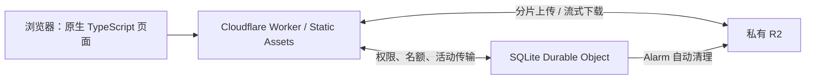

# Lite Drop · 轻投

基于 Cloudflare Workers、私有 R2 和 SQLite Durable Objects 的轻量文件投送工具。页面只有上传与下载两个入口，默认显示下载，支持桌面和手机浏览器。无需自建服务器；选择 Google 登录时，身份验证使用 Google OAuth。

[私有部署配置](docs/deployment.md) · [Google 登录配置](docs/google-oauth.md) · [验证记录](docs/validation.md)

仓库只提供通用示例配置，不包含真实域名、邮箱白名单、Google 客户端或 Cloudflare 账户标识。默认使用密码认证；实际生产配置和记录保存在 Git 忽略的私有文件中，见 [部署配置说明](docs/deployment.md)。

- 一次投送一个文件，最大 **500 MB（500,000,000 字节）**。
- 上传支持 Google 邮箱白名单、共享密码或免验证模式；上传者设置 **6～12 位数字接收码、有效期、下载次数**。
- 下载者输入接收码后直接下载，保留中文文件名。
- 上传密码或接收码输错一次，同一 IP 的对应入口锁定 **60 秒**，两个入口独立计时。
- 文件过期或次数用完后立即停止接收新下载，等待已开始的传输结束后自动清理。

## 阅读导航

- [本地运行](#本地运行)
- [部署到自己的 Cloudflare 账户](#部署到自己的-cloudflare-账户)
- [切换上传认证方式](#切换上传认证方式)
- [站点用量保护](#站点用量保护)
- [行为说明](#行为说明)
- [API](#api)
- [验证](#验证)
- [项目目录](#项目目录)
- [常见问题](#常见问题)

## 运行结构



应用和存储只部署在 Cloudflare；启用 Google 模式时，身份验证另外调用 Google OAuth 服务。前端不使用外部字体、CDN 脚本或第三方统计；构建使用 Vite。所有部署绑定写在 `wrangler.jsonc` 中，无须 D1、KV、Cron 或 R2 S3 密钥。

一个安装使用一个 Durable Object 协调元数据。文件字节通过 Worker 与 R2 流式传输；分片为 8 MiB，最多 3 个并发请求，不把整个文件缓存在浏览器或 Worker 内存中。

## 本地运行

需要 Node.js 22.12+（已在 Node.js 24 上验证）及 npm。

```powershell
git clone https://github.com/YOUR_USERNAME/lite-drop.git
cd lite-drop
npm ci
Copy-Item .dev.vars.example .dev.vars
npm run dev
```

克隆前将 `YOUR_USERNAME` 替换为仓库所有者。打开 **http://127.0.0.1:8787**；`npm run dev` 使用密码模式，示例密码是 `change-this-local-password`，可以在 `.dev.vars` 修改。本地开发不会修改线上配置。`.dev.vars` 已排除在 Git 之外，本地 R2 和 SQLite 数据保存在 `.wrangler` 中。

后端代码修改后 Wrangler 自动更新。修改前端时，另外开一个终端执行 `npm run dev:assets`，Vite 会持续重建页面；随后刷新浏览器。

macOS/Linux 可用 `cp .dev.vars.example .dev.vars` 替代 `Copy-Item`。已有 `.dev.vars` 时无需再次复制。

## 部署到自己的 Cloudflare 账户

需要账户已启用 R2。Workers 与 SQLite Durable Objects 支持 Free 计划，R2 有免费额度，超出额度按 Cloudflare 规则计费：[Workers 限制](https://developers.cloudflare.com/workers/platform/limits/)、[Durable Objects 计划](https://developers.cloudflare.com/durable-objects/platform/pricing/)、[R2 计费](https://developers.cloudflare.com/r2/pricing/)。

首次使用 R2 时，先在控制台打开 **Storage & databases → R2 Object Storage**，由账户持有人确认开通 R2 订阅。开通页面显示当前应付金额和超额用量价格；这一步包括接受服务条款。若命令返回 `Please enable R2 through the Cloudflare Dashboard`（错误码 `10042`），说明 R2 尚未开通，重新登录 Wrangler 不能解决。[R2 开通说明](https://developers.cloudflare.com/r2/get-started/)

### 1. 登录并创建私有存储桶

```powershell
npx wrangler login
npx wrangler r2 bucket create lite-drop-example-files
npx wrangler r2 bucket dev-url disable lite-drop-example-files
npx wrangler r2 bucket lifecycle add lite-drop-example-files abort-incomplete files/ --abort-multipart-days 1
```

存储桶名称必须与 `wrangler.jsonc` 的 `r2_buckets[0].bucket_name` 一致。保留 R2 私有状态，自定义域名绑定到 **Worker**，不要直接绑定到 R2。

生命周期规则只负责回收超过 1 天的未完成分片，覆盖创建分片后意外失去上传 ID 的情况。已完成文件由 Durable Object Alarm 按实际有效期和下载状态清理，不使用按天删除所有对象的规则。

### 2. 检查并部署

`wrangler.jsonc` 使用示例 Worker 和桶名，`routes` 为空，默认启用密码认证。部署前将资源名称改为自己的值；使用自定义域名时添加相应 `routes`，只使用 `workers.dev` 可保持为空。Google 模式需要自行配置 OAuth 客户端、回调和邮箱白名单。[自定义域名配置](https://developers.cloudflare.com/workers/wrangler/configuration/#custom-domains)

如需避免将实际配置提交到 Git，复制为 `wrangler.production.jsonc` 并使用 `--config wrangler.production.jsonc` 部署，详见 [私有生产配置](docs/deployment.md#保留私有生产配置)。公开 `public/privacy.html` 中的示例联系方式也应替换为站点实际说明，或将定制页面保存在 `.private/privacy.html` 后于构建时复制。

```powershell
npm run check
npm run deploy
```

首次部署会通过 `new_sqlite_classes` 自动创建 Durable Object 命名空间。Wrangler 输出 `workers.dev` 地址，也可在 Cloudflare 控制台为这个 Worker 设置自定义域名。

### 3. 写入生产 Secret

```powershell
npx wrangler secret put APP_SECRET
npx wrangler secret put UPLOAD_PASSWORD
```

按提示分别输入：

- `APP_SECRET`：至少 32 个字符的独立随机密钥，推荐 32 随机字节的 64 位十六进制表示。它用于会话签名和接收码/IP/凭证摘要；保持稳定，变更后已有接收码将无法查询，已有会话也会失效。
- `UPLOAD_PASSWORD`：共享上传密码。切换为 Google 模式时，使用 `npx wrangler secret put GOOGLE_CLIENT_SECRET` 配置客户端密钥，步骤见 [Google 登录](docs/google-oauth.md)。使用私有配置文件时，以上命令也需要追加 `--config wrangler.production.jsonc`。

首次部署至写入 Secret 之间，接口会提示尚未配置。`.dev.vars` 中的示例值不会由 `wrangler deploy` 上传为生产 Secret。

免验证模式仍需设置 `APP_SECRET`：将 `UPLOAD_AUTH_MODE` 改为 `"password"`，并将 `UPLOAD_PASSWORD_REQUIRED` 改为 `"false"` 后部署。Google 模式下密码开关不会关闭白名单验证，旧密码和旧密码 Cookie 均不能上传。

## 配置

### 切换上传认证方式

三种方式共用同一套上传、下载和自动清理逻辑。在 `wrangler.jsonc` 的 `vars` 中设置下表变量，然后运行 `npm run deploy`。页面与服务端会同步切换，无须修改业务代码。

| 上传方式 | `UPLOAD_AUTH_MODE` | `UPLOAD_PASSWORD_REQUIRED` | 必需配置 |
|---|---|---|---|
| 无需认证，任何人可上传 | `"password"` | `"false"` | `APP_SECRET` |
| 共享密码认证 | `"password"` | `"true"` | `APP_SECRET`、`UPLOAD_PASSWORD` Secret |
| Google 邮箱白名单认证 | `"google"` | `"true"` | `APP_SECRET`、Google 客户端配置及邮箱白名单 |

当前配置沿用原来的密码开关：**免认证模式使用 `password` + `false`，不要将 `UPLOAD_AUTH_MODE` 直接填为 `none`。** Google 模式忽略密码开关，旧密码不能绕过邮箱白名单；配置缺失时拒绝上传，不会自动降级为免认证。

Google 模式需要 `GOOGLE_CLIENT_ID`、`GOOGLE_REDIRECT_URI`、`GOOGLE_ALLOWED_EMAILS` 和 `GOOGLE_CLIENT_SECRET` Secret。回调固定路径为 `/api/auth/google/callback`，完整 HTTPS 地址必须与 Google 控制台一致。邮箱白名单以逗号分隔，验证 Google 签名和 `email_verified` 后按小写精确匹配；不会合并 Gmail 点号或加号别名。完整流程见 [Google 登录配置](docs/google-oauth.md)。

切换认证方式不会删除已有文件，也不会改变接收码下载规则。保持 `APP_SECRET`、R2 桶和 Durable Object 绑定稳定。`npm run dev` 为方便本地开发会覆盖为密码模式，这不会修改生产配置。

Secret 仅通过 Cloudflare Secret 和本地私有配置文件保存。仓库只包含 `.dev.vars.example` 占位示例；`.dev.vars`、`.dev.vars.production`、`.dev.vars.google`、本地状态、测试报告和构建产物均排除在 Git 之外。

### 站点用量保护

默认启用以下服务端额度，变量位于 `wrangler.jsonc`。它们控制这一个 Lite Drop 实例的操作，不是 Cloudflare 账户的账单硬封顶。

| 变量 | 默认值 | 含义 |
|---|---|---|
| `MAX_STORED_BYTES` | `5000000000` | 全站最多预占 5 GB，包括正在上传、已发布、活动下载和待清理文件 |
| `MAX_ACTIVE_FILES` | `200` | 同时保留的文件/上传会话数量，零字节文件也占一个名额 |
| `MAX_UPLOADS_PER_DAY` | `50` | 每日最多创建 50 次上传会话，取消或创建失败不退还次数 |
| `MAX_DOWNLOADS_PER_DAY` | `1000` | 每日最多发起 1000 次文件读取 |
| `MAX_DOWNLOADS_PER_MONTH` | `20000` | 每月最多发起 20000 次文件读取 |
| `MAX_R2_CLASS_A_PER_DAY` | `1000` | 每日存储写操作额度，包含创建分片上传、每次分片尝试和完成上传 |
| `MAX_R2_CLASS_A_PER_MONTH` | `10000` | 每月存储写操作额度 |
| `MAX_R2_CLASS_B_PER_DAY` | `2000` | 每日存储读操作额度，包含完成前的 HEAD 和下载 GET |
| `MAX_R2_CLASS_B_PER_MONTH` | `50000` | 每月存储读操作额度 |
| `MAX_PART_ATTEMPTS` | `4` | 每个分片最多实际尝试 4 次，即首次 + 3 次重试 |
| `MAX_COMPLETE_ATTEMPTS` | `4` | 每个文件最多尝试完成 4 次；已完成接口的幂等重试不占用 |

- 容量在创建上传时按完整声明大小原子预占，实际分片长度仍由服务端严格校验。并发请求不能突破总量。只有 R2 分片中止和对象删除确认成功后才释放容量；清理失败或活动下载尚未结束时继续占用。
- 日/月额度分别按 **UTC 自然日 / 自然月**重置（北京时间每日 08:00 / 每月 1 日 08:00），与 Cloudflare 账单周期不一定一致。所有计数保存在 SQLite Durable Object 中，刷新、换 IP、并发请求或运行时重启都不会清零。
- 每次实际 R2 读写前先扣额度，失败、取消或确认响应丢失也不退还；超时不代表平台未执行。完成操作提前预扣 HEAD 和可能的 CompleteMultipartUpload，所以恢复重试可能保守地多计一次。已确认分片和已完成上传的幂等重试不访问 R2，也不重复计数。
- **文件的剩余下载次数**与**站点读取额度**分别统计：发送前故障会释放文件名额，但站点操作额度仍保留。正常已开始的下载不会因站点额度耗尽而被截断。
- 达到日/月额度返回 `429 SITE_QUOTA_EXCEEDED` 和 `Retry-After`，页面显示恢复时间；这不会触发用户的密码/接收码 60 秒锁定。容量和文件数量满时也拒绝创建新上传。分片还在服务端限制为每文件最多 3 个并发。
- 额度耗尽仍允许取消和清理。R2 的 DeleteObject 和 AbortMultipartUpload 属于免费操作，不受读写额度限制。[R2 计费](https://developers.cloudflare.com/r2/pricing/)
- 容量、文件数及日/月额度可以设置为 `0` 来拒绝对应的新操作；`0` 从不表示无限制。尝试次数至少为 `1`。配置无效时服务拒绝操作。

这些保护不统计账户内其他项目、控制台/S3 的额外操作、既有孤立对象或 Cloudflare 的其他产品。保持 Workers Free；不要依靠清空 Durable Object 状态来重置额度。上传保留权限验证，R2 保持私有。

在 **Manage account → Billing → Billable usage → Budget alerts** 设置小额提醒（例如 1 美元），收件人为账户账单邮箱。告警只通知，不会停止计费。[预算告警说明](https://developers.cloudflare.com/billing/manage/budget-alerts/)

### 文件规则与认证配置

修改 `wrangler.jsonc` 中的 `vars` 后重新部署。Secret 通过 Wrangler 或 Cloudflare 控制台管理。

修改绑定或配置变量后，执行 `npm run types` 更新 `worker/bindings.d.ts`，再执行类型检查。生成文件只有类型声明，不包含 Secret 的值。

| 名称 | 默认值 | 含义 |
|---|---:|---|
| `UPLOAD_AUTH_MODE` | `"password"` | Google 白名单或原密码模式 |
| `GOOGLE_CLIENT_ID` / `GOOGLE_REDIRECT_URI` | 空 | Google 模式必须配置，回调使用 HTTPS 且精确匹配 Google 控制台 |
| `GOOGLE_ALLOWED_EMAILS` | 空 | 服务端邮箱白名单，逗号分隔；不合并 Gmail 点号或加号别名 |
| `GOOGLE_CLIENT_SECRET` | Secret | Google 模式必须配置，缺失时拒绝上传 |
| `UPLOAD_PASSWORD_REQUIRED` | `"true"` | 只接受 `"true"` / `"false"`；缺省开启，错误配置不会自动开放上传 |
| `DEFAULT_TTL_SECONDS` | `"86400"` | 默认有效期，24 小时 |
| `MAX_TTL_SECONDS` | `"2592000"` | 最大有效期，30 天；可设为 60～31,536,000 秒 |
| `DEFAULT_DOWNLOADS` | `"1"` | 默认可下载次数 |
| `MAX_DOWNLOADS` | `"1000"` | 最大可下载次数；可设为 1～1,000,000 |
| `APP_SECRET` | Secret，无默认值 | 签名和摘要密钥，至少 32 字符 |
| `UPLOAD_PASSWORD` | Secret，无默认值 | 仅密码模式且开启密码验证时必须配置 |

默认值必须在对应上限以内。页面的自定义有效期单位是分钟，建议有效期配置使用 60 的整数倍。文件上限固定为 500 MB，不通过配置放大。上传密码验证有效期为 1 小时，未完成的上传最多保留 24 小时。

## 行为说明

### 上传

1. Google 白名单验证或密码验证成功后获得 1 小时的 HttpOnly、SameSite=Strict 会话 Cookie；HTTPS 下带 Secure 和 `__Host-` 前缀。Google 模式校验签名、签发者、受众、有效期、nonce 和已验证邮箱。
2. 创建上传时验证文件设置并占用接收码，返回仅适用于这个文件的随机上传凭证。后续分片、完成、取消都需要它，不能仅凭上传 ID 操作文件。创建时获取的上传凭证可用于完成本次上传，不受 1 小时登录会话到期影响。
3. 分片失败最多自动重试 3 次；仍失败可在当前页面点击“重试投送”。服务端会复用已确认的分片。刷新/关闭页面后不恢复上传，残留由后台清理。
4. 完成时使用服务端记录的分片信息和实际 R2 大小校验，只有发布成功后才开始计算有效期。完成请求可以安全重试。

### 下载和计次

- 接收码按字符串处理，保留前导零。无效、已过期、次数耗尽均返回统一提示。
- 验证成功只生成绑定当前 IP 的 60 秒一次性凭证，不扣次。浏览器通过隐藏下载框发起原生下载，不创建整文件 Blob。
- 开始下载时先预留名额，读取 R2 成功后原子扣次。发送前的故障释放名额；已开始发送后的取消、断网仍计一次。丢失扣次确认消息且尚未发送时，服务端会尝试幂等回滚本次扣次。
- 多个请求不能抢走同一个最后名额。凭证重复使用、跨 IP 使用、到期使用被拒绝；Range/断点续传不受支持，重新下载需要重新输入接收码并占用一次机会。
- 下载响应为附件，使用 `no-store`，不开放 R2 公共下载路径。

### 锁定与清理

- IP 取自 Cloudflare 的 `CF-Connecting-IP`。同一出口 IP 下的用户共享锁定；换浏览器或刷新不能解除。重复请求不延长原有 60 秒期限。
- 锁定与接收码判断在同一个持久化状态中串行处理；锁定期间输入正确内容也被拒绝。API 返回 `429`、`Retry-After` 和剩余秒数，页面显示倒计时。
- 每次开始下载都同步判断有效期，访问失效不依赖后台任务是否准时执行。
- Worker 每 60 秒为活动传输续期。租约 180 秒失联后回收；Worker 会在到期前 5 秒停止未能续期的文件流。页面关闭不影响已交给浏览器的下载续期。
- Alarm 清理已到期/耗尽且没有活动下载的文件。失败时保留状态并按 5 秒起步、最多 1 小时的间隔重试；状态和任务能跨 Durable Object 重启恢复。
- 物理删除是可重试的后台过程，平台维护或存储故障可能延迟执行；访问有效期仍立即生效。文件与关联状态删除完成后才释放接收码。
- 应用只输出固定的无敏感信息错误事件，默认关闭 Workers 请求日志采集。本地开发使用 `--log-level warn`，避免开发请求日志记录下载凭证 URL。

## API

同源 JSON 接口返回 `{ error, message, retryAfter? }` 表示错误；成功响应不包含存储桶公开地址。

| 方法和路径 | 输入 / 行为 |
|---|---|
| `GET /api/config` | 公开限制、当前会话状态、当前 IP 的两个锁定期限 |
| `POST /api/auth/google/start` | 同源请求；设置 10 分钟流程 Cookie 并返回 Google 登录地址 |
| `GET /api/auth/google/callback` | 唯一允许跨站导航的 API；验证并原子消费 state、兑换令牌、校验邮箱 |
| `POST /api/auth/logout` | 清除当前浏览器的 Google 会话 Cookie |
| `POST /api/upload-auth` | `{ password }`；成功设置上传 Cookie |
| `POST /api/uploads` | `{ name, size, code, ttlSeconds, downloads }`；返回 `{ id, token, partSize, partCount }` |
| `PUT /api/uploads/:id/parts/:number` | 二进制分片；`Authorization: Bearer <上传凭证>`；返回分片编号和 ETag |
| `POST /api/uploads/:id/complete` | 同上上传凭证；返回文件名、大小、到期时间、下载次数 |
| `DELETE /api/uploads/:id` | 同上上传凭证；安排取消与清理 |
| `POST /api/downloads/prepare` | `{ code }`；返回 `{ ticket, expiresIn: 60 }` |
| `GET /api/downloads/:ticket` | 单次原生附件下载；验证 IP、有效期与剩余次数 |

浏览器跨站请求被拒绝；CLI 客户端可以不发送 Origin，但不能伪造不同的 Origin。JSON 请求限制 8 KiB；密码、接收码只通过请求体传递。

## 验证

```powershell
npm run check
```

包含前端/Worker/测试 TypeScript 检查、Workers runtime 中的 Vitest 测试、前端构建与 Wrangler 部署 dry run。测试使用本地绑定，不操作远程 R2。

目前共有 **63 项 Workers 集成测试**。覆盖 Google 邮箱白名单、令牌签名/受众/签发者/有效期/nonce、登录回调并发重放、浏览器绑定、旧密码绕过防护、密码开关、缺失配置、持久化锁定、并发爆破、上传所有权、500 MB 边界、伪造分片长度、分片幂等、零字节文件、R2 完成响应丢失、名额争抢、凭证重放、发送前回滚、发送后取消、跨有效期流式传输、租约续期/失联、无人访问时清理、删除失败和重启恢复。用量保护测试包含容量并发预占、删除失败继续占用容量、日/月额度跨重启和重置边界、分片与完成重试上限、服务端并发上限，以及额度耗尽后仍可清理。

故意发送过长/过短分片的用例会让本地 R2 模拟器输出连接中断诊断，这是故障注入产生的底层消息；测试仍会验证分片没有被确认，并且正确长度的重试可成功。

本地服务运行后：

```powershell
npm run test:large
npm run test:browser
```

- `test:large`：默认传输完整 500,000,000 字节，3 路分片上传、流式下载、SHA-256 校验，结束时清理本次测试文件。
- `test:browser`：默认使用系统 Chrome，验证真实浏览器分片上传、中文文件名原生下载、锁定刷新、移动端布局，并保存截图。可通过 `PLAYWRIGHT_CHANNEL=msedge` 使用 Edge。
- 报告和截图输出到 `test-results/`，不提交 Git。浏览器测试最后会触发上传和下载锁定，同一 IP 需等倒计时结束再运行下一次验证测试。

上述上传测试脚本适用于密码或免认证模式。线上验收请对**独立测试部署**运行相同脚本：

```powershell
$env:LITE_DROP_URL = "https://你的测试Worker.workers.dev"
$env:LITE_DROP_PASSWORD = "测试部署上传密码"
npm run test:large
npm run test:browser
```

可用 `LITE_DROP_BYTES` 指定较小测试大小。线上脚本不会读取本地 `.dev.vars`，也不会输出密码或凭证。500 MB 验证会产生对应测试部署的 R2 存储和操作用量。

最新的本地及线上验证记录见 [验证记录](docs/validation.md)。本地模拟器结果不能替代线上 CPU/内存和网络环境验证。

Google 模式的公开页面与未登录拦截检查使用 `node scripts/google-ui-smoke.mjs`。必须通过 `LITE_DROP_URL` 指定自己的 Google 模式测试实例；脚本不预设线上域名，不登录 Google 账号、不上传文件。完整 OAuth 登录需在浏览器中手动验证。

## 项目目录

```text
lite-drop/
├── src/                    # 中文页面、上传分片与原生下载交互
├── public/                 # 图标、安全响应头、隐私说明
├── worker/
│   ├── index.ts            # API 路由与文件流式传输
│   ├── core.ts             # 配置、会话、摘要与请求校验
│   ├── google.ts           # Google OAuth 与 ID Token 验证
│   ├── state.ts            # SQLite Durable Object 状态与清理
│   ├── quotas.ts           # 站点日/月操作额度
│   └── lease.ts            # 活动传输续期与失联终止
├── shared/                 # 前后端共享协议和限制
├── tests/                  # Workers Vitest 集成测试
├── scripts/                # 大文件、浏览器与 Google 页面验收
├── docs/                   # 私有部署配置、OAuth 和脱敏验证记录
├── .dev.vars.example       # 本地 Secret 占位示例
├── wrangler.jsonc          # Cloudflare 资源绑定及部署配置
└── README.md               # 中文使用与部署文档
```

## 常见问题

**500 MB 文件会超过 Worker 单次请求限制吗？** 文件以 8 MiB 分片上传到 Worker，再写入 R2 Multipart Upload；不会将整个 500 MB 文件放进一个上传请求。

**R2 文件会公开吗？** 不会。接收码验证成功后签发一次性凭证，由 Worker 返回附件文件流；R2 保持私有，不提供公共桶地址。

**文件下载失败会扣次数吗？** 发送开始前的服务端故障释放预留名额；已经开始发送后取消或断网仍计一次。第一版不支持断点续传。

**切换认证或更新代码会丢失文件吗？** 常规部署沿用原来的 R2 和 Durable Object 数据。不要删除状态、改换桶或随意更换 `APP_SECRET`；这些操作会影响已有文件或接收码。

**为什么换浏览器仍然提示等待？** 锁定由服务端按真实出口 IP 持久化保存，同一出口 IP 共用倒计时。上传和下载分别锁定，重复请求不会延长当前锁定。

**是否有后台和文件列表？** 没有。当前只提供上传、凭码下载和自动清理，不包含账号注册、管理后台、文件列表或在线预览。
